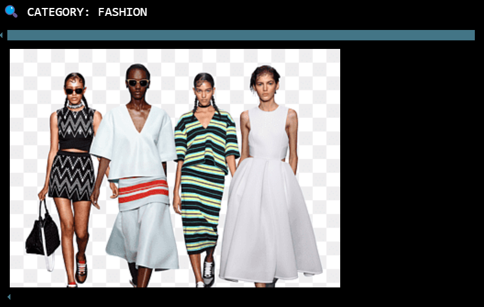
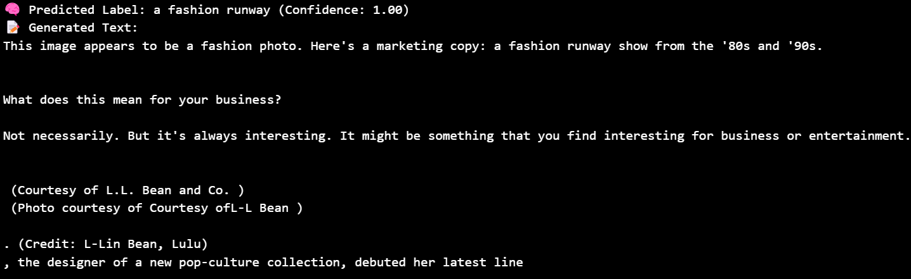

# 🧠 Multimodal_Visual_Knowledge_Assistant

**Multimodal_Visual_Knowledge_Assistant** is a smart AI system that uses computer vision and natural language processing to understand images and generate meaningful text-based responses. By combining the power of **CLIP** and **GPT-2**, this project analyzes images across various domains—Medical, Fashion, Microscopy, and Nature—and produces relevant insights or creative descriptions.

# OUTPUT Demo 




---

## 🚀 Features

- 🔍 **Image Classification** using OpenAI’s CLIP model.
- 🧠 **Text Generation** using GPT-2 for dynamic, context-aware language.
- 📷 Visual display of images, predictions, and generated texts.
- 🔄 Supports domain-specific prompts for deeper semantic relevance.
- 💡 Easy to scale by adding new categories and label sets.

---

## 📁 Project Structure

---

## ⚙️ Tech Stack

| Task                   | Tool / Library                      |
|------------------------|------------------------------------|
| Multimodal Encoding    | `CLIP` (`openai/clip-vit-base-patch32`) |
| Language Generation    | `GPT-2` (`gpt2`)                   |
| Deep Learning Framework| `PyTorch`                          |
| Tokenization & Modeling| `Hugging Face Transformers`        |
| Image Display & Parsing| `Pillow`, `IPython.display`        |

---

## 🧩 Use Case Categories

| Category    | Example Labels                                                             | Prompt for GPT-2                                               |
|-------------|----------------------------------------------------------------------------|-----------------------------------------------------------------|
| **Medical** | MRI with tumor, Normal MRI, X-ray with fracture, CT scan                  | *"This image appears to be a medical scan. Based on the content, we can infer:"* |
| **Fashion** | Red dress, Man in suit, Runway fashion, Casual outfit                     | *"This image appears to be a fashion photo. Here's a marketing copy:"* |
| **Microscopy** | Cell structure, Bacteria culture, Virus, Tissue sample               | *"This is a microscopy image. Scientifically, this could imply:"* |
| **Nature**  | Mountain landscape, Forest, Beach, Ocean pollution                         | *"This is a natural scene. Here's a creative caption or fact:"* |

---

## 🧪 How It Works

1. **Load Models**  
   Load CLIP and GPT-2 from Hugging Face's model hub.

2. **Classify Image**  
   CLIP processes the image and predicts the most probable label from a set of predefined domain-specific labels.

3. **Generate Text**  
   GPT-2 generates a natural language output based on the predicted label and a domain-specific prompt.

4. **Display Results**  
   The notebook displays the original image, predicted label with confidence, and generated descriptive text.

---

## 📥 Installation

Make sure you have Python 3.8+ and install the required dependencies:

```bash
pip install torch torchvision
pip install transformers
pip install pillow
